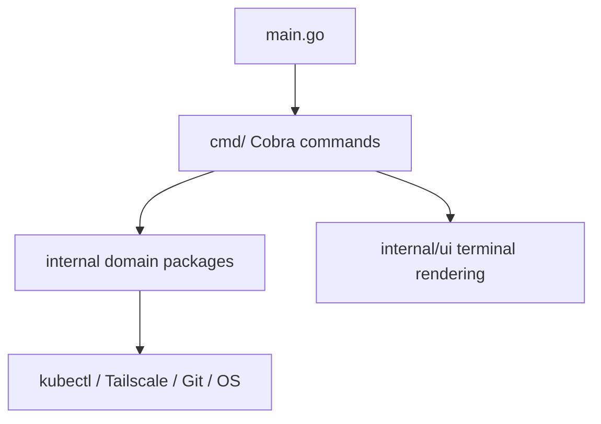

# Development

eggl CLI keeps command orchestration separate from domain behavior.



## Repository layout

| Path | Responsibility |
| --- | --- |
| `main.go` | Calls `cmd.Execute()` |
| `cmd/` | Cobra commands, flags, orchestration, command tests |
| `internal/config/` | YAML loading, defaults, and validation |
| `internal/env/` | Profile detection and switching |
| `internal/pf/` | Kubernetes port-forward behavior |
| `internal/dedash/` | Em-dash replacement and Git scoping |
| `internal/eol/` | Line-ending normalization and Git scoping |
| `internal/kill/` | Platform-specific process discovery and termination |
| `internal/ui/` | Interactive and plain output rendering |

## Local commands

```bash
make fmt
make test
make check
make build
go vet ./...
```

`make check` runs formatting validation and the race-enabled test suite. The CI workflow also runs vet, govulncheck, coverage, and a build.

## Testing conventions

Domain packages use focused unit tests and command packages test Cobra behavior through temporary files, fake adapters, and captured output. Keep commands thin and put new behavior in `internal/<domain>/`.

When adding a command:

1. Add domain behavior under `internal/`.
2. Add a thin `cmd/<name>.go` with `RunE` and `SilenceUsage: true`.
3. Add command and domain tests.
4. Reuse `internal/ui` for styled output when the command reports structured state.
5. Run `make fmt && make check`.
