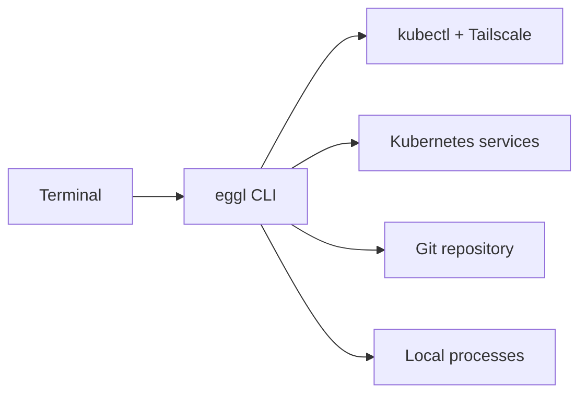

## What eggl CLI does

eggl CLI is intentionally small. It connects the local tools that sit between a terminal, a Kubernetes cluster, and a working repository without trying to replace any of them.

## Start here

- [Install eggl CLI](/install)
- [Configure your first profile](/quickstart)
- [Read the command reference](/commands)
